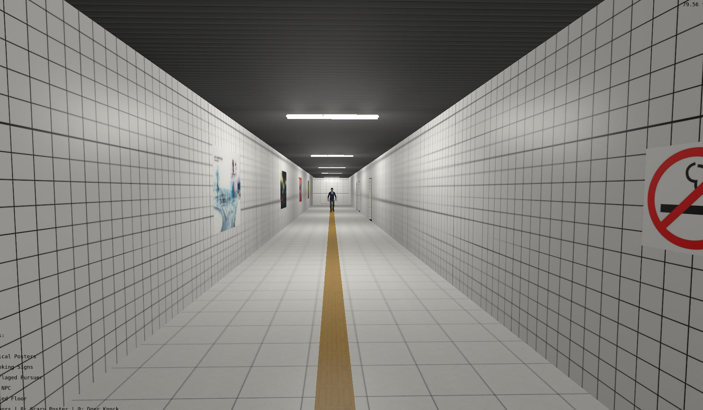
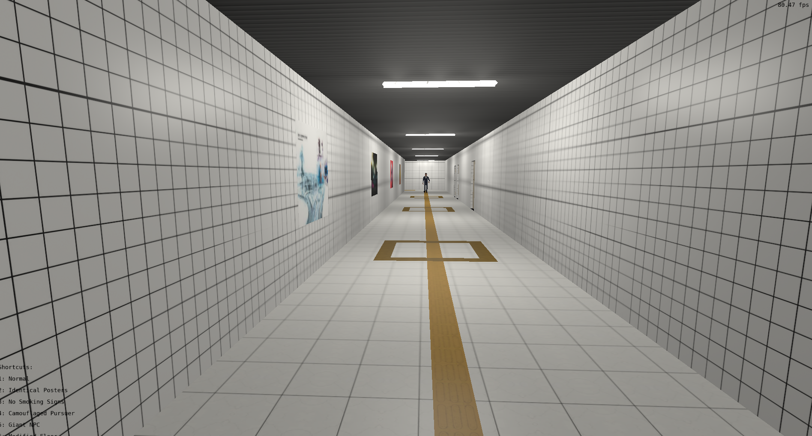

# Trabalho Final - Computação Gráfica e Visualização I (INF01047)

## Descrição da Aplicação
Este projeto é um clone simplificado do jogo "The Exit 8", desenvolvido em C++ utilizando OpenGL. A aplicação consiste em um simulador de caminhada em primeira e terceira pessoa através de um corredor de metrô aparentemente infinito. O jogador deve observar os arredores em busca de anomalias, que podem ser: duas portas ao invés de três, piso tátil alterado, cartazes assustadores, um NPC perseguidor camuflado, um NPC maior que o normal, diversas placas de não fume, cartazes na parede todos iguais ou som de batidas na porta. Se encontrar uma anomalia, o jogador deve retornar; se o corredor estiver normal, deve seguir em frente. O objetivo é tomar a decisão correta 8 vezes seguidas para alcançar a "Exit 8". A aplicação demonstra conceitos de computação gráfica, incluindo iluminação de Phong com múltiplas luzes, renderização de modelos 3D, curvas de Bézier para a movimentação de NPCs, colisão cilindro-cilindro, AABB e testes de varredura (raycast/sweep) para colisão da câmera de 3ª pessoa, mapeamento procedural do cenário utilizando instanciamento baseado na posição da câmera e áudio espacializado.

## Uso de Ferramentas de Inteligência Artificial
**Fizemos uso extensivo de ferramentas de IA, principalmente Codex e Antigravity, para o desenvolvimento deste trabalho.** (Os prompts utilizados estão documentados no arquivo `PROMPTS.md`).
**Análise Crítica:** A ferramenta foi extremamente útil para fornecer a base inicial do código do OpenGL, escrever os shaders de iluminação Phong e para estruturar lógicas arquiteturais complexas, como a mecânica do cenário infinito ("3-Tile Treadmill") e o carregamento das animações esqueléticas dos FBX via Assimp. Contudo, ela falhou consideravelmente ao lidar com cálculos espaciais dinâmicos e matrizes tridimensionais; o modelo da IA se confundiu repetidas vezes com os vetores de direção matemática, gerando bugs onde os NPCs andavam de costas ou os cartazes apareciam na parede errada quando o jogador percorria o corredor no sentido inverso. Nesses casos, foi necessário intervir manualmente e guiar a IA passo a passo na matemática vetorial. No geral, a IA acelerou muito a produção da aplicação, mas exigiu forte revisão na lógica de orientação e matrizes.

## Imagens do Funcionamento



## Manual do Usuário
* **W, A, S, D:** Movimentação do personagem pelas direções principais.
* **Mouse:** Rotação da câmera (olhar ao redor em primeira pessoa).
* **Shift (Segurar):** Correr (aumenta a velocidade de movimento e acelera as animações/passos do personagem).
* **Teclas Numéricas (ex: 1 a 9):** Atalhos de teclado implementados para forçar o surgimento de anomalias específicas no próximo corredor gerado.

## Compilação e Execução

### No Linux
Abra um terminal na raiz do projeto e instale as dependências necessárias para compilação:
```bash
sudo apt-get install build-essential make libx11-dev libxrandr-dev libxinerama-dev libxcursor-dev libxcb1-dev libxext-dev libxrender-dev libxfixes-dev libxau-dev libxdmcp-dev libassimp-dev
```
Em seguida, para compilar e executar via CMake, utilize:
```bash
cmake --workflow --preset configure-build-run
```

( ou rode `cmake -B build -S .`, seguido de `cmake --build build` e rode o binário)

### No Windows
1. Instale o VSCode e o compilador GCC (através do MSYS2/MinGW-w64).
2. Instale o CMake.
3. No VSCode, instale as extensões "C/C++" e "CMake Tools".
4. Abra o diretório do projeto no VSCode e selecione o compilador GCC nas configurações do CMake Tools.
5. Pressione o botão "Play" na barra inferior do editor para compilar e executar.

Alternativamente, no terminal Windows, estando na raiz do projeto:
```bash
cmake -B build-mingw
cmake --build build-mingw
```


---
O executável será gerado e poderá ser executado a partir do diretório de build ou da pasta `bin\Debug`.

