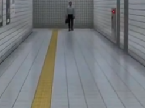
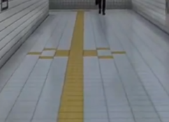
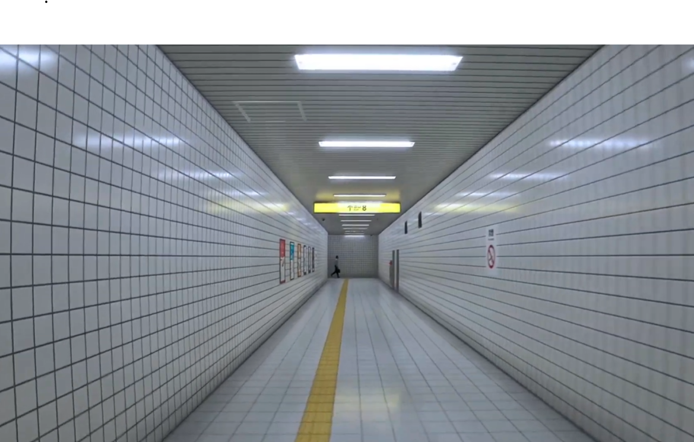

# Especificação da Implementação

> [!CAUTION]
> - Você <ins>**não pode utilizar ferramentas de IA para escrever esta
>   especificação**</ins>

## Integrantes da dupla

- **Aluno 1 - Nome**: <mark>`Murilo Primaz Pereira`</mark>
- **Aluno 1 - Cartão UFRGS**: <mark>`00589756`</mark>

- **Aluno 2 - Nome**: <mark>`Renan Muller`</mark>
- **Aluno 2 - Cartão UFRGS**: <mark>`00588968`</mark>

## Detalhes do que será implementado

- **Título do trabalho**: <mark>`Exit 8`</mark>
- **Parágrafo curto descrevendo o que será implementado**: <mark>`Vamos implementar uma versão um pouco simplificada do jogo Exit 8. Nesse jogo, controlamos um personagem que percorre várias vezes o mesmo corredor, tendo que identificar anomalias para decidir se segue em frente ou volta atrás, com o objetivo de percorre-lo 8 vezes, chegando na estação 8. Em nossa versão implementaremos somente algumas das anomalias presentes no jogo original`</mark>

## Especificação visual

### Vídeo - Link

> [!IMPORTANT]
> - Coloque aqui um link para um vídeo que mostre a aplicação gráfica
>   de referência que você vai implementar. **Sua implementação deverá
>   ser o mais parecido possível com o que é mostrado no vídeo (mais
>   detalhes abaixo).**
> - **Você não pode escolher como referência: (1) algum trabalho realizado
>   por outros alunos desta disciplina, em semestres anteriores. (2) Minecraft.**
> - Por exemplo, você pode colocar um vídeo de um jogo que você gosta,
>   e seu trabalho final será uma re-implementação do jogo.
> - O vídeo pode ser um link para YouTube, Google Drive, ou arquivo mp4 dentro
>   do próprio repositório. Mas, garanta que qualquer um tenha
>   permissão de acesso ao vídeo através deste link.

<mark>`https://www.youtube.com/watch?v=NCEw6WJkuFs`</mark>

### Vídeo - Timestamp

> [!IMPORTANT]
> - Coloque aqui um **intervalo de ~30 segundos** do vídeo acima, que
>   será a base de comparação para avaliar se o seu trabalho final
>   conseguiu ou não reproduzir a referência.

- **Timestamp inicial**: <mark>`1:19`</mark>
- **Timestamp final**: <mark>`1:49`</mark>

### Imagens

> [!IMPORTANT]
> - Coloquei aqui **três imagens** capturadas do vídeo acima, que você
>   irá usar como ilustração para as explicações que vêm abaixo.

*Figura 1: Chão normal*

*Figura 2: Chão anômalo*

*Figura 3: Corredor do jogo*

## Especificação textual

> [!IMPORTANT]
> - Coloquei aqui **três imagens** capturadas do vídeo acima, que você
>   irá usar como ilustração para as explicações que vêm abaixo.

Para cada um dos requisitos abaixo (detalhados no [Enunciado do Trabalho final - Moodle](https://moodle.ufrgs.br/mod/assign/view.php?id=6018620)), escreva um parágrafo **curto** explicando como este requisito será atendido, apontando itens específicos do vídeo/imagens que você incluiu acima que atendem estes requisitos.

### Malhas poligonais complexas
<mark>`Esse requisito será atendido pois nosso trabalho usará malhas complexas para representar todos os elementos do corredor, como paredes, tetos, quadros nas paredes, portas, luminária, além dos npcs e anomalias eventualmente encontradas, conforme observado nas imagens. `</mark>

### Transformações geométricas controladas pelo usuário
<mark>`O usuário controlará uma câmera em primeira pessoa com movimentação via teclado (WASD) e rotação via mouse. Isso permitirá explorar o corredor livremente, como visto no vídeo, incluindo olhar ao redor para identificar anomalias. Além disso, em terceira pessoa o personagem se tornará um objeto controlável.`</mark>

> Comentário Professor: Conforme especificação no Moodle, é necessário ter algum outro tipo de objeto sendo controlado pelo usuário, além da câmera.

### Diferentes tipos de câmeras
<mark>`Serão implementadas duas opções de câmera, uma em primeira pessoa e outra câmera de visão em terceira pessoa. Diferentemente do jogo original, no qual há apenas a opção de primeira pessoa, em nossa implementação o usuário poderá escolher entre as duas. `</mark>

### Instâncias de objetos
<mark>`Elementos repetidos como luzes, portas e placas serão implementados via instanciamento de objetos, reduzindo custo computacional. Isso reflete a repetição clara do corredor ao longo do vídeo.`</mark>

### Testes de intersecção
<mark>`Serão implementados testes de colisão entre o jogador, câmera e o ambiente, impedindo o jogador ou a câmera de atravessar paredes e objetos. Também haverá gatilhos invisíveis para detectar progresso no corredor ou reset de estado.`</mark>

> Comentário Professor: a câmera em terceira pessoa também será "contida" dentro das paredes?

### Modelos de Iluminação em todos os objetos
<mark>`Será aplicado modelo de iluminação Phong com fontes de luz posicionadas no teto, simulando lâmpadas. A iluminação será essencial para criar o clima do jogo, como mostrado nas imagens. Além disso, a reflexão Glossy nas paredes também será implementada.`</mark>

> Comentário Professor: a reflexão das lâmpadas nas paredes, de forma Glossy, é um visual interessante do jogo. Não tentarão fazer?

### Mapeamento de texturas em todos os objetos
<mark>`Texturas serão aplicadas em paredes, chão, placas e portas, incluindo padrões repetitivos típicos de metrôs.`</mark>

### Movimentação com curva Bézier cúbica
<mark>`Uma entidade (por exemplo, NPC ou anomalia) poderá se mover ao longo de uma curva Bézier cúbica, criando movimento suave e não linear dentro do corredor.`</mark>

### Animações baseadas no tempo ($\Delta t$)
<mark>`Movimentos do jogador e possíveis eventos (como anomalias) serão baseados em delta time para garantir consistência independente do framerate.`</mark>

## Limitações esperadas

> [!IMPORTANT]
> - Coloque aqui uma lista de detalhes visuais ou de interação que
>   aparecem no vídeo e/ou imagens acima, mas que você **não pretende
>   implementar** ou que você **irá implementar parcialmente**.
> - Para cada item, **explique por que** não será implementado ou por
>   que será implementado parcialmente.

<mark>IA complexa de NPCs não será implementada:  
O comportamento de personagens será limitado, com movimentos simples. 
A versão implementada terá apenas um subconjunto de anomalias (somente a primeira aparece no vídeo)</mark> 
1. Chão modificado, comparação pode ser vista nas duas imagens do chão, sendo o chão anômalo o que contém o padrão mais complexo;
2. Diversas placas de No Smoking ao invés de somente uma;
3. Homem caminhando pelo corredor tem estatura muito maior que o padrão;
4. Somente duas portas ao invés de 3;
5. Posters idênticos na parede;
6. Foto assustadora no lugar de um dos posters.
7. Homem camuflado com a textura da parede no fim do corredor, ao se deparar com ele ele persegue o jogador.
8. Som de batidas na porta

<mark>Essa limitação no número de anomalias se deve a extensa quantidade e complexidade. 
Qualidade gráfica AAA não será atingida: 
Shaders avançados não serão implementados devido à complexidade. 
Sistema de áudio será simplificado: 
Som ambiente e efeitos não serão foco principal.
</mark>
